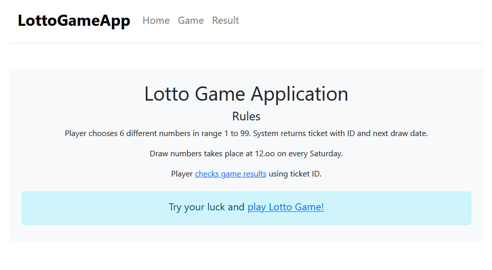

# Lotto Game App - Frontend

### Game Rules
Player chooses 6 different numbers in range 1 to 99. System returns ticket with ID and next draw date.
Draw numbers takes place at 12.oo on every Saturday.
Player checks game results using ticket ID.

### Languages
This project was created with [React](https://react.dev/boo), [JavaScript](https://www.javascript.com/), [Formik](https://formik.org/) library and [Bootstrap](https://getbootstrap.com/).
### Screens

